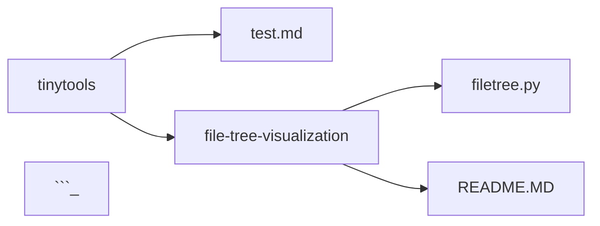

give it a path, receive a file/folder tree in a fancy format

# filetree.py
shows a full folder directory in indented or mermaid style. there's probably a bunch of edge cases with characters and naming that needs to be taken care of

## using filetree.py
reqires some recent version of python.  build for full windows paths (uses backslash). 
- launch file directly, it should ask you about specifics
- python filetree.py PATH MODE
- protip: can uses stdout so it can be piped to file with "> filename"
- protip2: piping to .md file in obsidian sounds great until encoding comes and ruins it

## modes
output modes for different use cases:
- dash: indents using a dash
- mermaid: creates a full mermaid graph
- obsidian: only shows files that obsidian can read, folders are headers at their according level, files are linked
- obsidiandash: same as above but without headers, just dash indent


## configure
edit filetree.py for defining ignored folders or how to behave on dot-prefixed "hidden files"

## examples
### show tinytools directory in dash style
> python filetree.py "a:\git\tinytools" dash

output:
```
a:\git\tinytools
-test.md
-file-tree-visualization
-a:\git\tinytools\file-tree-visualization
--filetree.py
--README.MD
```

### show tinytools directory in mermaid style
> python filetree.py "a:\git\tinytools" mermaid

output:
```


## shortcomings
- bound to windows OS (as far as I tried, but there's lots of backslash)
- no output to file, and piping to file may be weird encoding
- ^this should be fixed with a custon print function that directs, encodes, ...
- it always shows full path, not a cut off from where you start
