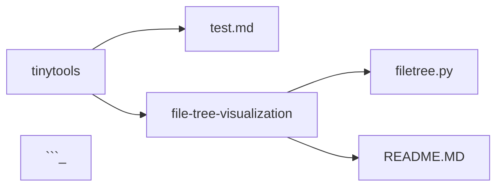

give it a path, receive a file/folder tree in a fancy format
maybe do cool stuff in python, some one-liner in powershell?

# filetree.py
## using filetree.py
reqires some recent version of python.  build for full windows paths (uses backslash). Modes are "dash" and "mermaid"
- launch file directly, it should ask you about specifics
- python filetree.py PATH TYPE

## configure
edit filetree.py for defining ignored folders or how to behave on "hidden files"

## examples
### show tinytools directory in dash style
> `python filetree.py "a:\git\tinytools" dash`

output:
```
a:\git\tinytools
-test.md
-file-tree-visualization
-a:\git\tinytools\file-tree-visualization
--filetree.py
--README.MD
```

### show tinytools directory in mermaid style
> `python filetree.py "a:\git\tinytools" mermaid`

output:
```

